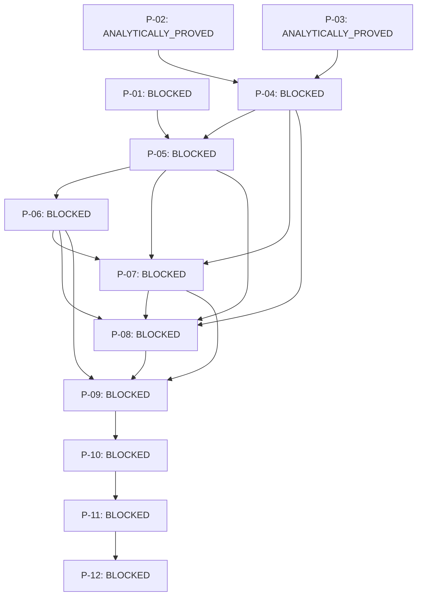

# First-pivot closure graph

The nodes below are generated from the public closure API. An edge means that
the source obligation must be discharged before the target can close. Status
`ANALYTICALLY_PROVED` is used only for the two Phase Q results proved at their
stated logical strength. It does not imply a common closed symbol calculus.

| ID | Statement | Status | Closure criterion |
|---|---|---|---|
| `P-01` | Identify Wplus_12 in a closure-compatible operator class. | `BLOCKED` | an exact or certified mod-compact class identification |
| `P-02` | Represent U1 and prove the exact ordered factorized composition R1 U1. | `ANALYTICALLY_PROVED` | retain the exact ordered pair (r1,d_gamma1) without an E-tilde claim |
| `P-03` | Represent Ghat1 and certify the ordered R1 Ghat1 semiproduct. | `ANALYTICALLY_PROVED` | Op(r1)M_Ghat1 is Op(r1 Ghat1) modulo compact operators |
| `P-04` | Place the separately controlled R1 U1 and R1 Ghat1 cases in one admissible H1 framework. | `BLOCKED` | one named admissible framework covering both relations at their proved strengths |
| `P-05` | Control (R1 B1)Wplus_12 without reordering factors. | `BLOCKED` | derive a certified model for the ordered three-factor suffix |
| `P-06` | Control Q1 before R1 B1 Wplus_12 without commuting it. | `BLOCKED` | preserve the stored order and produce a controlled remainder |
| `P-07` | Prove compactness of every accumulated residue. | `BLOCKED` | all residuals lie in K(L^p(R_+,w_delta)) with branch typing |
| `P-08` | Identify the resulting symbol and its precise class. | `BLOCKED` | one named symbol in a verified Mellin or cusp quotient class |
| `P-09` | Propagate the closure result to all 16 Phase O terms. | `BLOCKED` | all 16 terms receive a relation of identical certified strength |
| `P-10` | Reconstruct the complete correction C2 from the 16 controlled terms. | `BLOCKED` | recover C2 without changing the Phase N mod-compact relation |
| `P-11` | Prove membership of N2first in the selected operator class or algebra. | `BLOCKED` | a proved membership theorem with an identified quotient symbol |
| `P-12` | Only after membership, verify nonvanishing and Fredholmness conditions. | `BLOCKED` | all hypotheses of the chosen criterion are checked |

## Critical paths

- Phase P originally left P-02 at `FORMALLY_REDUCED` and P-03 at
  `SOURCE_VERIFIED`. Phase Q preserves that history and discharges the exact
  factorized composition and coefficient semiproduct separately.
- P-04 remains blocked: the first result is exact but factorized, whereas the
  second is a standard Mellin semiproduct only modulo compact operators.

- H1 depends on P-02, P-03, P-04, and P-07.
- H2 additionally depends on P-01 and P-05.
- H3 additionally depends on P-06.
- Propagation to the correction begins only at P-09.
- Membership and any later Fredholm test are strictly ordered as P-11 then
  P-12.
